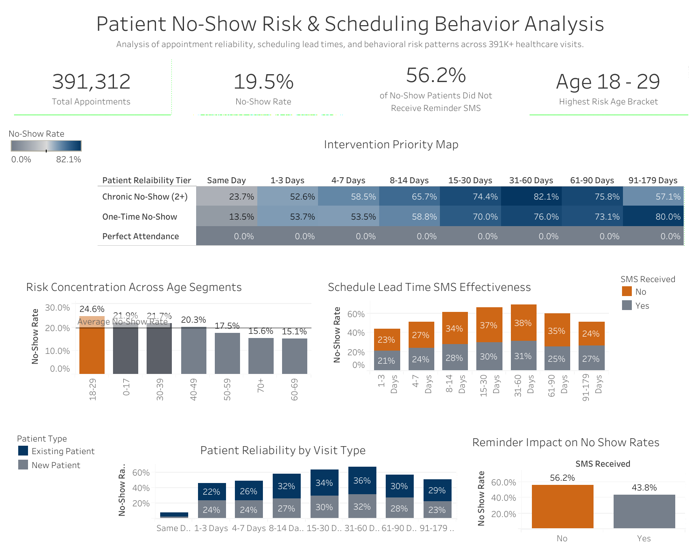
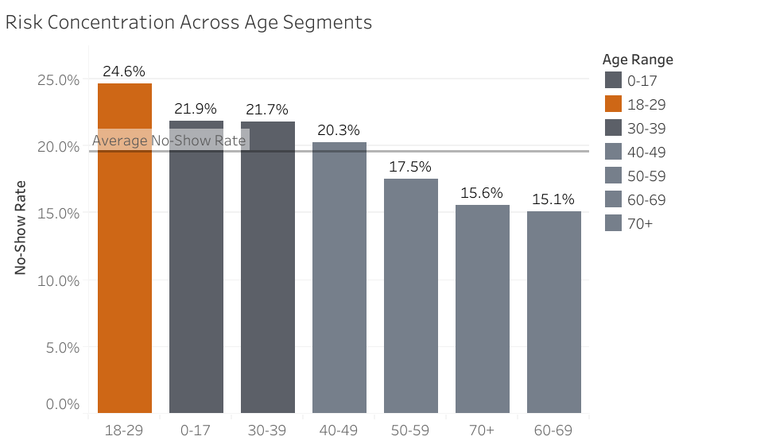
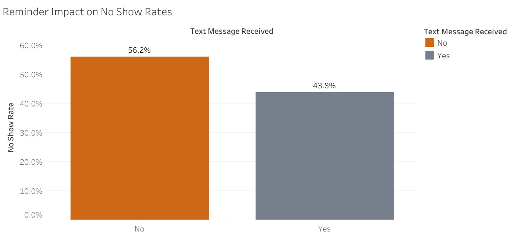
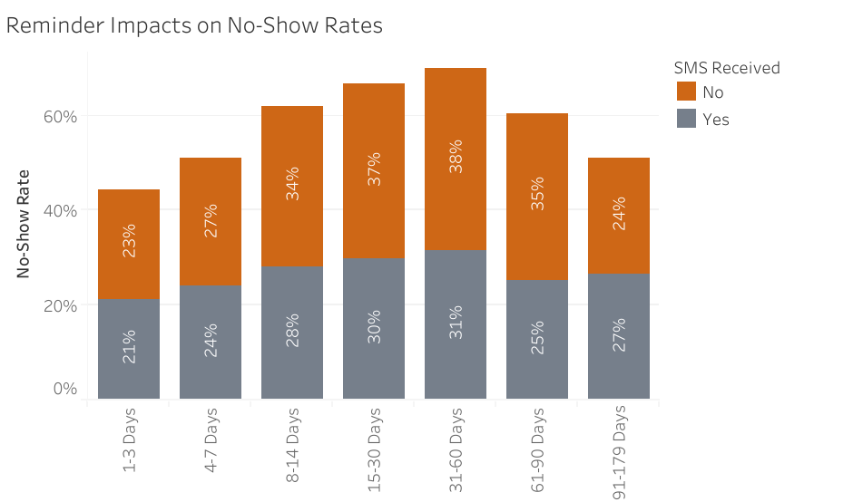

# Identifying Drivers of Missed Medical Appointments 

## 🚀 Executive Summary
This project is a healthcare analytics project analyzing patient appointment behavior to uncover operational, demographic, and scheduling factors associated with higher no-show rates using PostgreSQL and Tableau. 
---

## 📌 Business Problem
Missed appointments (“no-shows”) create significant operational and financial inefficiencies for healthcare providers by reducing revenue, underutilizing clinical resources, and limiting access for other patients. These missed visits are driven by multiple factors such as patient demographics, scheduling lead time, and prior attendance behavior, making it difficult for organizations to proactively address the issue without data-driven insight. The core business problem is identifying the key drivers of patient no-shows so healthcare administrators can predict high-risk appointments, implement targeted interventions, and ultimately improve appointment attendance rates and overall clinic efficiency.

---

## 🎯 Objectives
Key objectives:

- Quantify Overall No-Show Rate: Establish a baseline understanding of appointment completion vs. no-show behavior to measure the scale of the problem.

- Evaluate Scheduling Influence: Analyze how factors like appointment lead time, day of the week, and time of day impact the likelihood of a patient not showing up.

- Identify High-Risk Patient Segments: Segment patients based on behavioral patterns (e.g., repeat no-shows, new vs. returning patients, age segments) to highlight groups most associated with missed appointments.

---

## 🧠 Approach
This project follows the **Google Data Analytics framework**:

**Ask → Prepare → Process → Analyze → Share → Act**

---

## 📊 Dataset
This analysis uses a healthcare appointment dataset containing approximately six months of scheduling activity and one month of clinical appointment outcomes. The dataset includes patient demographic information such as age, gender, and neighborhood location, along with clinical and operational variables including co-morbidities, appointment scheduling date, appointment date, SMS reminder status, and final appointment attendance outcome (show vs. no-show).

To maintain data quality and analytical accuracy, patient records with ages below 0 or above 102 were excluded from age-based analysis, as these values were determined to be likely data entry errors.

---

## 🧹 Data Cleaning & Preparation
Data cleaning and transformation were performed using Google Sheets and PostgreSQL to improve data quality and ensure accurate analysis. Key preparation steps included:

- Spell Checking & Formatting: Reviewed and corrected minor spelling inconsistencies and formatting issues using Google Sheets.

- Data Validation: Used PostgreSQL aggregation functions (MIN() and MAX()) to identify invalid age values within the dataset.

- Outlier Handling: Detected patient ages of -1 and 115, which were treated as likely data entry errors. These records were excluded from age-bracket analysis to maintain analytical accuracy.

- Data Transformation: Created calculated fields and categorical groupings in PostgreSQL, including age brackets and appointment lead-time ranges, to support trend analysis and dashboard visualization.

---

## 📊 Key Insights (Quick View)
Overall No-Show Rate: 19.5%

High-Risk Age Bracket: Ages 18 - 29 (24.6% No-Show Rate)

SMS Reminders: 56.2% of No-Show appointments did not receive SMS reminders

Schedule Lead Time "Danger Zone": No show rates significantly increase after at 15+ schedule lead time. The majority of "one time offenders"(80%) no show between 90 and 180 day lead time.
---

## 📊 Interactive Dashboard
[View on Tableau Public](https://public.tableau.com/app/profile/greg.washam/viz/NoShowAnalysis_17785967473760/Dashboard1)

## 📸 Dashboard Preview

## 🔍 Detailed Insights

# High-Risk No-Show Age Bracket

  

The analysis identified the 18–29 age bracket as the primary driver of missed appointments across all patient groups. While the clinic’s overall no-show rate was 19.5%, patients between the ages of 18 and 29 demonstrated a significantly higher no-show rate of 24.6%. This finding suggests that younger adult patients may face greater scheduling conflicts, inconsistent routines, or lower engagement with appointment adherence, making them a high-risk segment for targeted reminder systems and attendance intervention strategies.

# The "Reminder Gap": Impact of SMS on scheduling compliance

  
  

A critical insight emerged from the SMS reminder analysis: only 25.6% of patients received SMS reminders, while 56.2% of patients who missed their appointments did not receive a reminder. This suggests that SMS reminders may play an important role in reducing no-show rates. Additionally, a consistent behavioral pattern was observed across both groups—patients who received reminders and those who did not—as no-show rates generally increased as appointment lead time increased. Interestingly, this trend reversed after approximately 60 days, where no-show rates began to decline slightly. These findings suggest that both reminder systems and scheduling lead time influence patient attendance behavior.

# Schedule Lead Time "Danger Zone"

  

A clear risk threshold emerged when analyzing appointment scheduling lead time. No-show rates remain relatively stable at shorter lead times but begin to increase significantly once appointments are scheduled 15 or more days in advance. This suggests that longer gaps between booking and appointment date may reduce patient engagement or increase the likelihood of forgetting or deprioritizing the visit.

A more concentrated pattern is observed among repeat no-show behavior. The majority of “one-time offenders” (approximately 80%) who missed their appointments were associated with long scheduling windows between 90 and 180 days. This indicates that extremely long lead times may disproportionately contribute to isolated no-show events, potentially due to reduced perceived urgency or changes in patient circumstances over time. Together, these findings highlight schedule lead time as a key operational lever for reducing missed appointments and improving overall attendance reliability.

---

## 💡 Recommendations

- Increase SMS Enrollment: Expand patient enrollment in SMS reminders during scheduling and check-in to improve reminder coverage and reduce missed appointments.

- Reduce Long Lead Times: Minimize appointment scheduling gaps where possible, as no-show risk increases significantly after 15+ days.

- Target High-Risk Appointments: Apply additional reminders or confirmation outreach for appointments scheduled 90–180 days in advance.

- Focus on Younger Patients: Develop communication strategies for patients aged 18–29, the highest-risk no-show demographic.

- Monitor Trends Continuously: Track no-show rates, reminder effectiveness, and scheduling trends through ongoing dashboard reporting.

---

## 📈 Business Impact
### Financial Impact: Cost Saving and Revenue Opportunities

Reducing patient no-shows can improve both operational efficiency and financial performance for healthcare organizations. Missed appointments create gaps in provider schedules that result in lost revenue opportunities while also increasing administrative workload through follow-up calls, rescheduling efforts, and provider notifications. Improving appointment attendance allows clinics to maximize provider utilization, reduce wasted scheduling capacity, and allocate staff time more efficiently toward patient care and other revenue-generating activities.
    

### Clinical Impact: Improving Patient Outcomes

Reducing patient no-show rates can lead to improved clinical outcomes by increasing continuity of care and treatment adherence. When patients attend scheduled follow-up appointments and remain engaged with physician recommendations, providers are better able to monitor conditions, adjust treatment plans, and identify health concerns earlier. Improved appointment adherence may ultimately contribute to better long-term patient outcomes and stronger overall quality of care.

---

## 🛠 Tools Used
- SQL  
- Tableau  
- Data Analysis  

---

## ⚠️ Challenges
- Large dataset: Utilized PostgreSQL to efficiently handle 300,000+ entries

---

## 📂 Project Structure
- SQL queries for analysis  
- Tableau dashboard for visualization  